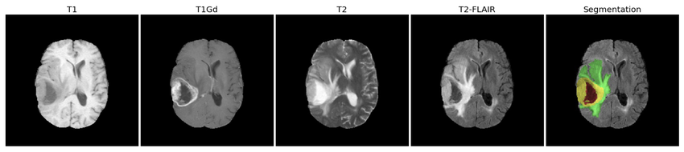
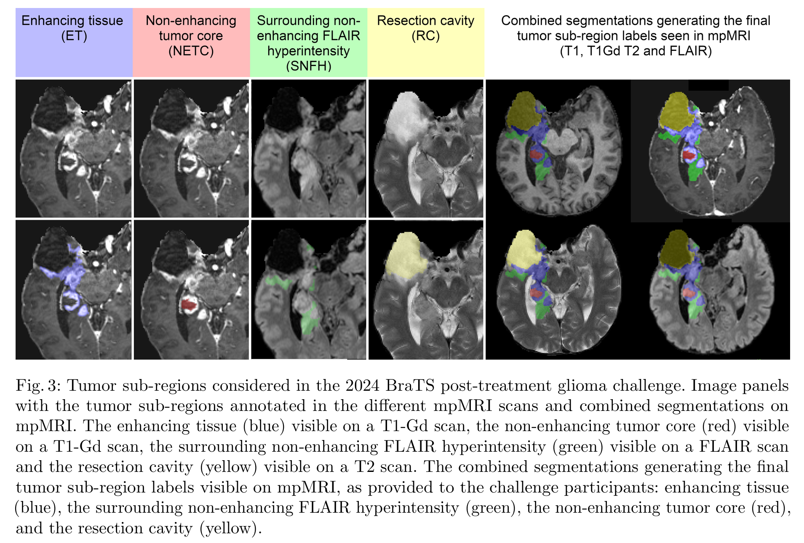
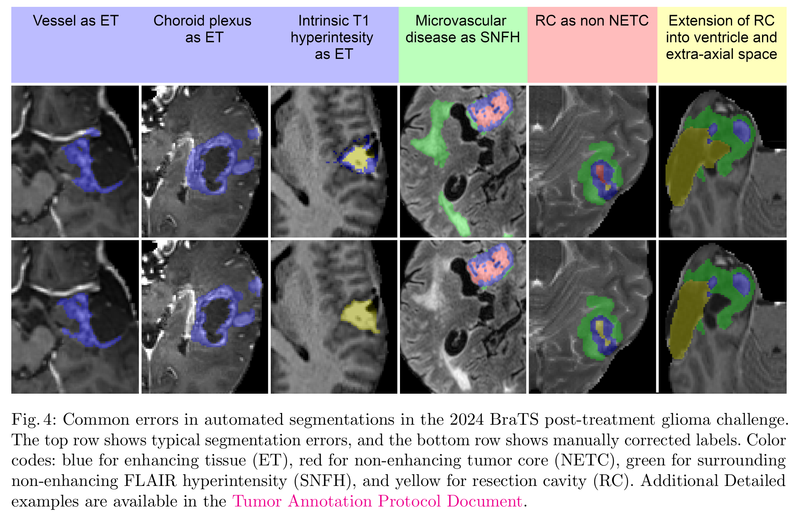
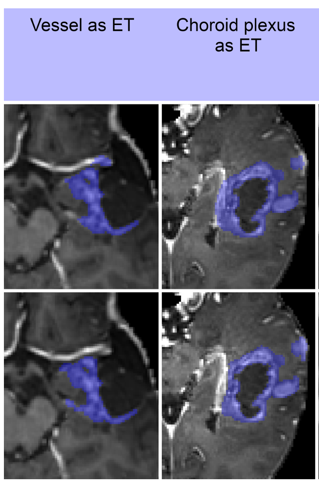
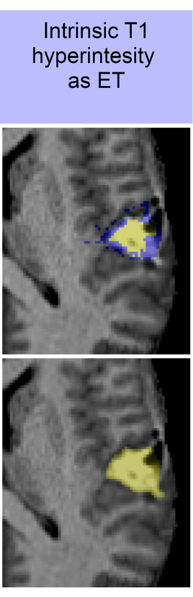
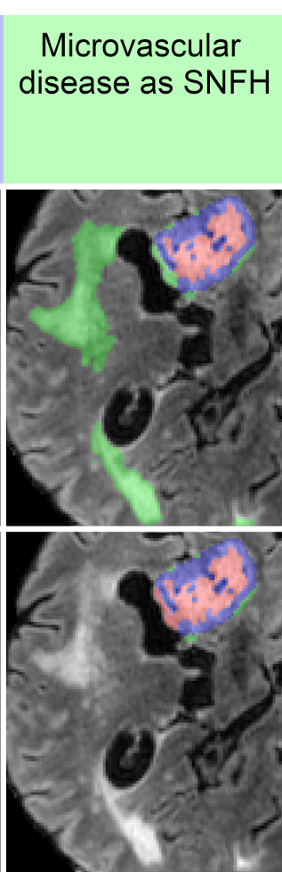
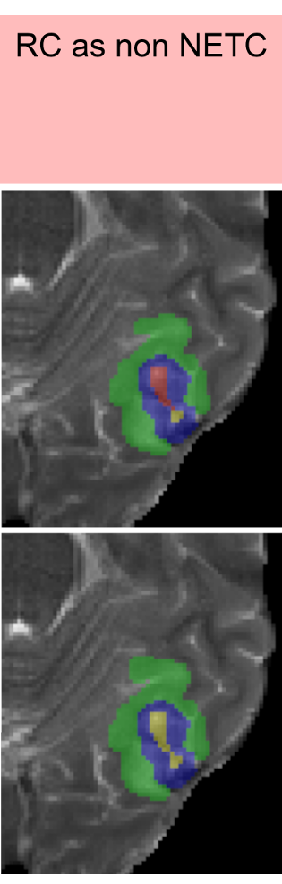
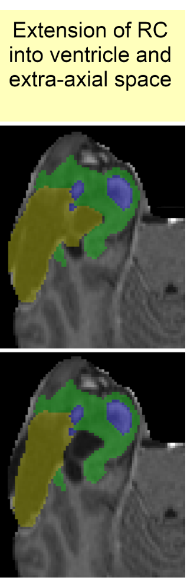

# Tumor Annotation

Tài liệu này giải thích các chuỗi xung MRI cơ bản và định nghĩa chính xác 4 labels được sử dụng trong bộ dữ liệu BraTS 2024.

## 1. Nguyên lý các Chuỗi xung MRI (MRI Sequences)

### **1.1. T1-weighted (T1)**
*   **Tên gọi:** Ảnh có trọng số T1.
*   **Analogy:** "Bản đồ giải phẫu" của não. Nó hiển thị cấu trúc, hình dạng và các mốc giải phẫu với độ sắc nét cao.
*   **Nguyên lý cốt lõi:** Chuỗi xung này nhạy với thời gian hồi phục T1 của các proton trong mô. Các mô mà proton nhanh chóng "hồi phục" năng lượng sẽ có tín hiệu mạnh (sáng).
    *   **Mỡ (Fat):** Hồi phục rất nhanh → **Sáng**.
    *   **Nước/Dịch não tủy (CSF):** Hồi phục rất chậm → **Tối**.
    *   Chất trắng sáng hơn chất xám một chút.
*   **Vai trò trong việc gán nhãn:**
    *   Là **ảnh nền (baseline)** để so sánh với T1-Gd, nhằm xác định **Enhancing Tissue (ET)**.
    *   Rất quan trọng để xác định **"tăng tín hiệu T1 tự nhiên" (intrinsic T1 hyperintensity)**. Nếu một vùng đã sáng sẵn trên T1w, nó có thể chứa sản phẩm máu và sẽ được gán nhãn là **Non-enhancing Tumor Core (NETC)**, không phải ET.

### **1.2. T2-weighted (T2)**
*   **Tên gọi:** Ảnh có trọng số T2.
*   **Analogy:** "Bản đồ bệnh lý (nước)". Hầu hết các quá trình bệnh lý (u, viêm, phù) đều làm tăng hàm lượng nước, và T2 làm những vùng này "phát sáng".
*   **Nguyên lý cốt lõi:** Chuỗi xung này nhạy với thời gian thư duỗi T2. Các mô mà proton duy trì được sự đồng pha lâu sẽ có tín hiệu mạnh (sáng).
    *   **Nước/Dịch não tủy (CSF):** Đồng pha rất lâu → **Sáng rực**.
    *   **Mỡ (Fat):** Cũng sáng.
*   **Vai trò trong việc gán nhãn:**
    *   Đặc biệt hữu ích để xác định **Resection Cavity (RC)**, vì khoang này chứa đầy dịch và sẽ sáng rực trên T2.
    *   Cũng cho thấy vùng **Surrounding Non-enhancing FLAIR Hyperintensity (SNFH)**, nhưng thường bị nhiễu bởi tín hiệu sáng của dịch não tủy.

### **1.3. FLAIR (Fluid-Attenuated Inversion Recovery)**
*   **Tên gọi:** Chuỗi xung phục hồi đảo ngược xóa tín hiệu dịch.
*   **Analogy:** "Bản đồ bệnh lý nâng cao". Đây là một phiên bản T2 được tinh chỉnh để làm nổi bật tổn thương.
*   **Nguyên lý cốt lõi:** Về cơ bản là một chuỗi xung T2, nhưng nó có thêm một bước để **xóa tín hiệu của dịch não tủy (CSF)**, làm cho CSF trở nên đen. Điều này cực kỳ quan trọng, vì nó giúp các tổn thương chứa nước khác (như phù não) nổi bật lên một cách ngoạn mục, đặc biệt khi chúng nằm gần não thất.
*   **Vai trò trong việc gán nhãn:**
    *   Là chuỗi xung **quan trọng nhất và tốt nhất** để xác định ranh giới của **Surrounding Non-enhancing FLAIR Hyperintensity (SNFH)**. Vùng này sẽ sáng rực trên nền não và CSF tối, giúp việc khoanh vùng chính xác hơn nhiều.

### **1.4. T1-Gd (T1-weighted with Gadolinium contrast)**
*   **Tên gọi:** Ảnh T1 có tiêm thuốc cản quang Gadolinium.
*   **Analogy:** "Bản đồ hoạt động của u". Nó chỉ ra nơi nào hàng rào máu não bị phá vỡ, tức là nơi các tế bào u đang hoạt động mạnh mẽ nhất.
*   **Nguyên lý cốt lõi:** U ác tính tạo ra các mạch máu bất thường làm hỏng hàng rào máu não (Blood-Brain Barrier - BBB). Khi tiêm thuốc cản quang, thuốc sẽ rò rỉ qua hàng rào này và tích tụ trong mô u, làm vùng đó **sáng rực** lên trên ảnh T1.
*   **Vai trò trong việc gán nhãn:**
    *   Là chuỗi xung **duy nhất và quyết định** để xác định **Enhancing Tissue (ET)**. Một vùng được coi là ET khi và chỉ khi nó tối/mờ trên T1 và trở nên sáng rõ trên T1-Gd.

---

## 2. Labels from BraTS 2024 and their meaning

### **2.1. Enhancing Tissue (ET) - Xanh dương**
*   **Định nghĩa:** Phần mô u hoạt động, được xác định bởi sự bắt thuốc cản quang.
*   **Chuỗi xung chính:** **T1-Gd**.
*   **Giải thích chi tiết:**
    *   Lớp này đại diện cho phần u có mật độ tế bào cao nhất và đang tăng sinh, nơi hàng rào máu não bị phá vỡ.
    *   **Quy tắc gán nhãn:**
        1.  **Loại trừ Mạch máu (Excluding vessels):** Các mạch máu lớn cũng sáng trên T1 vì chúng chứa thuốc cản quang.
        2.  **Phân biệt "Dày/Dạng nốt" và "Mỏng/Dạng đường thẳng":** Quy tắc nhấn mạnh chỉ bao gồm các vùng bắt thuốc **dày (thick)** hoặc **dạng nốt (nodular)**. Các vùng bắt thuốc **mỏng, dạng đường thẳng (thin linear)** dọc theo khoang phẫu thuật thường là do sẹo và phản ứng viêm sau mổ, **không được tính là ET**.
        3.  **Sử dụng Ảnh trừ (Subtraction Image):** Thử thách đề xuất sử dụng ảnh trừ (lấy ảnh T1-Gd trừ đi ảnh T1) để phát hiện các vùng bắt thuốc tinh vi và quan trọng nhất là để phân biệt sự bắt thuốc thật sự với **tăng tín hiệu T1 tự nhiên**. Đây là công cụ kỹ thuật để thực thi nguyên tắc đã nêu trong giao thức chung.

### **2.2. Non-enhancing Tumor Core (NETC) - Đỏ**
*   **Định nghĩa:** Phần nhân u không hoạt động, không bắt thuốc, thường là hoại tử, nang, hoặc chứa sản phẩm máu cũ.
*   **Chuỗi xung chính:** **T1-Gd** và **T1** (để so sánh).
*   **Giải thích chi tiết:**
    *   Đây là trung tâm của khối u, nơi các tế bào đã chết do thiếu oxy hoặc đã hóa nang.
    *   **Quy tắc gán nhãn:**
        1.  **Định nghĩa dựa trên tín hiệu rõ ràng:** Quy tắc mô tả rõ: vùng này **tối trên cả T1 và T1-Gd** (đây là hoại tử/nang điển hình).
        2.  **Bao gồm Tăng tín hiệu T1 tự nhiên:** Quy tắc nêu rõ NETC cũng bao gồm các vùng **tối trên T1-Gd nhưng lại sáng hơn trên T1**. Đây chính là cách định nghĩa chính thức cho **"intrinsic T1 hyperintensity"** do máu cũ. Quy tắc này xác nhận rằng những vùng như vậy thuộc về NETC (nhãn đỏ), chứ không phải ET (nhãn xanh dương).

### **2.3. Surrounding Non-enhancing FLAIR Hyperintensity (SNFH) - Xanh lá**
*   **Định nghĩa:** Tất cả các vùng tăng tín hiệu bất thường trên FLAIR xung quanh u mà không phải là ET, NETC, hay RC.
*   **Chuỗi xung chính:** **FLAIR**.
*   **Giải thích chi tiết:**
    *   Trong bối cảnh sau điều trị, lớp này là một "chiếc ô" bao gồm nhiều hiện tượng không thể phân biệt bằng mắt thường:
        *   **Phù não (Edema):** Phản ứng của não đối với khối u.
        *   **U thâm nhiễm (Infiltrative Tumor):** Các tế bào u đơn lẻ xâm lấn vào mô não lành.
        *   **Thay đổi sau xạ trị (Radiation-related changes).**
        *   **Sẹo thần kinh đệm (Gliosis).**
    *   **Quy tắc gán nhãn:**
        1.  **Gộp tất cả:** Trong bối cảnh sau điều trị, rất khó phân biệt giữa u thâm nhiễm, phù não, **tăng tín hiệu do xạ trị (radiation-related hyperintensity)**, và **sẹo thần kinh đệm (gliosis)**. BraTS 2024 yêu cầu gộp tất cả các hiện tượng trên vào một nhãn SNFH duy nhất để đảm bảo tính nhất quán.
        2.  **Loại trừ Bệnh lý không liên quan:** Các vùng tăng tín hiệu đối xứng hoặc dạng đốm rõ ràng do bệnh thiếu máu vi mạch mãn tính (thường ở người lớn tuổi) thì **KHÔNG** được gán nhãn.

### **2.4. Resection Cavity (RC) - Vàng**
*   **Định nghĩa:** Khoang rỗng còn lại sau khi phẫu thuật cắt bỏ khối u. Chỉ áp dụng cho các ca sau phẫu thuật.
*   **Chuỗi xung chính:** **T2**.
*   **Giải thích chi tiết:**
    *   Đây là cái "hố" được lấp đầy bởi dịch não tủy hoặc các sản phẩm sau mổ.
    *   **Quy tắc gán nhãn:**
        1.  **Khoang mãn tính (Chronic):** Thường sau mổ >3-6 tháng, tín hiệu giống hệt dịch não tủy trên mọi chuỗi xung (sáng rực trên T2, tối trên T1/FLAIR).
        2.  **Khoang gần đây (Recent):** Tín hiệu có thể đa dạng do chứa máu, khí, hoặc protein.
        3.  **Phân biệt với NETC:** Một khoang RC thường thông ra bề mặt não hoặc hệ thống não thất, trong khi một nhân hoại tử (NETC) thường là một khoang kín nằm hoàn toàn bên trong khối u.

### **2.5. Phân tích Ví dụ Minh họa**

*   **Hàng trên:** Là các ảnh MRI gốc, chưa có nhãn.
*   **Hàng dưới:** Là kết quả sau khi chuyên gia gán nhãn.

1.  **Cột 1 (Enhancing tissue - ET):** Chuyên gia nhìn vào ảnh **T1-Gd**. Họ thấy một viền sáng không đều xung quanh một vùng tối. Họ tô màu **xanh dương** cho viền sáng này, cẩn thận tránh các mạch máu lân cận.
2.  **Cột 2 (Non-enhancing tumor core - NETC):** Vẫn trên ảnh **T1-Gd**, chuyên gia nhìn vào vùng tối bên trong viền bắt thuốc. Họ xác định đây là vùng hoại tử không có mạch máu và tô nó màu **đỏ**.
3.  **Cột 3 (SNFH):** Chuyên gia chuyển sang ảnh **FLAIR**. Họ thấy một vùng sáng lan tỏa, ranh giới mờ bao quanh toàn bộ khối u. Đây chính là vùng phù/thâm nhiễm. Họ tô nó màu **xanh lá**.
4.  **Cột 4 (Resection cavity - RC):** Chuyên gia nhìn vào ảnh **T2**. Họ thấy một vùng rất lớn, sáng rực, có hình dạng giống một khoang đã được phẫu thuật. Đây là khoang chứa đầy dịch. Họ tô nó màu **vàng**.
5.  **Cột 5 (Combined segmentations):** Đây là bước cuối cùng và là sản phẩm đầu ra cho mô hình học máy. Tất cả các nhãn từ các chuỗi xung khác nhau được **chiếu và tổng hợp** lên một không gian chung (ví dụ, hiển thị trên nền ảnh T1-Gd và FLAIR). Ta thấy rõ mối quan hệ không gian:
    *   Khoang phẫu thuật (vàng) ở phía trước.
    *   Khối u còn lại nằm ở phía sau khoang phẫu thuật, bao gồm:
        *   Viền bắt thuốc (xanh dương).
        *   Nhân hoại tử (đỏ) bên trong.
        *   Vùng phù/thâm nhiễm (xanh lá) bao bọc xung quanh.

---

## 4. Common Errors:

Hình ảnh này là một "bảng tổng kết" các sai lầm kinh điển. Hàng trên là **LỖI** của mô hình tự động, hàng dưới là **SỬA ĐÚNG** bởi chuyên gia.

*   **Chú giải màu sắc:**
    *   **Xanh dương (ET - Enhancing Tissue):** U bắt thuốc.
    *   **Đỏ (NETC - Non-Enhancing Tumor Core):** Nhân u không bắt thuốc.
    *   **Xanh lá (SNFH - Surrounding Non-enhancing FLAIR Hyperintensity):** Vùng tăng tín hiệu FLAIR xung quanh không bắt thuốc.
    *   **Vàng (RC - Resection Cavity):** Khoang phẫu thuật.

### **Lỗi 1 & 2: Nhầm lẫn Mạch máu (Vessel) và Đám rối màng mạch (Choroid Plexus) với U Bắt Thuốc (ET)**

*   **Lỗi (Hàng trên):** Mô hình đã tô màu xanh dương (ET) cho cả các cấu trúc mạch máu và đám rối màng mạch.
*   **Nguyên nhân của Lỗi:**
    *   **Mạch máu:** Sau khi tiêm thuốc cản quang (T1-Gd), thuốc nằm bên trong lòng mạch máu. Do đó, các mạch máu sẽ "sáng" lên. Mô hình chỉ đơn giản thấy "tín hiệu sáng trên T1" và kết luận đó là u bắt thuốc.
    *   **Đám rối màng mạch (Choroid Plexus):** Đám rối màng mạch là cấu trúc bình thường nằm trong não thất, có chức năng sản xuất dịch não tủy. Quan trọng nhất, nó **không có hàng rào máu não (BBB)**. Vì vậy, nó **luôn luôn bắt thuốc** một cách sinh lý bình thường. Mô hình bị đánh lừa bởi tín hiệu sáng này.
*   **Sửa lỗi (Hàng dưới):** Chuyên gia đã xóa nhãn xanh dương khỏi các cấu trúc này. Việc phân biệt đòi hỏi kiến thức về giải phẫu: mạch máu có dạng ống, tuyến tính, còn đám rối màng mạch có vị trí và hình dạng đặc trưng bên trong não thất. Đây không phải là mô u.

### **Lỗi 3: Nhầm Tăng tín hiệu T1 tự nhiên (Intrinsic T1 Hyperintensity) với U Bắt Thuốc (ET)**

*   **Lỗi (Hàng trên):** Mô hình tô xanh dương (ET) cho một vùng nhỏ.
*   **Nguyên nhân của Lỗi:** Vùng này có thể chứa các sản phẩm thoái giáng của máu (methemoglobin) từ một vi xuất huyết cũ. Điều này làm nó sáng sẵn trên ảnh T1 *trước khi tiêm thuốc*. Do đó, nó cũng sáng trên ảnh T1-Gd. Mô hình lại bị tín hiệu sáng này đánh lừa.
*   **Sửa lỗi (Hàng dưới):** Chuyên gia, sau khi so sánh với ảnh T1 trước tiêm, nhận ra đây không phải là sự bắt thuốc "thật sự". Dựa vào bối cảnh (có lẽ đây là một khoang phẫu thuật), họ đã sửa nhãn thành màu vàng (RC), cho thấy đây là máu cũ bên trong khoang phẫu thuật.

### **Lỗi 4: Nhầm Bệnh lý vi mạch (Microvascular Disease) với Phù/Thâm nhiễm (SNFH)**

*   **Lỗi (Hàng trên):** Mô hình tô màu xanh lá (SNFH) cho các đốm và dải sáng trên FLAIR, cách xa khối u chính.
*   **Nguyên nhân của Lỗi:** Bệnh lý thiếu máu vi mạch (thường gặp ở người lớn tuổi) gây ra các tổn thương nhỏ ở chất trắng, làm tăng hàm lượng nước và do đó sáng lên trên ảnh FLAIR. Mô hình chỉ thấy "sáng trên FLAIR" và kết luận đó là phù/thâm nhiễm liên quan đến u.
*   **Sửa lỗi (Hàng dưới):** Chuyên gia nhận ra các tổn thương này không liên quan đến khối u (dựa vào vị trí, hình dạng, và bối cảnh lâm sàng). Do đó, chúng được **loại bỏ hoàn toàn** khỏi nhãn phân vùng. Không phải cứ sáng trên FLAIR là thuộc về khối u.

### **Lỗi 5: Nhầm Khoang phẫu thuật (RC) với Nhân u không bắt thuốc (NETC)**

*   **Lỗi (Hàng trên):** Mô hình tô màu đỏ (NETC) cho một vùng lẽ ra phải là khoang phẫu thuật.
*   **Nguyên nhân của Lỗi:** Cả hai đều có thể là những khoang chứa dịch, tối trên T1 và sáng trên T2. Tín hiệu của chúng có thể rất giống nhau, gây nhầm lẫn cho mô hình.
*   **Sửa lỗi (Hàng dưới):** Chuyên gia dựa vào các đặc điểm khác: khoang phẫu thuật (RC) thường thông ra bề mặt não hoặc não thất, trong khi nhân hoại tử (NETC) thường là một khoang kín được bao bọc bởi u. Nhãn đã được sửa lại thành màu vàng (RC).

### **Lỗi 6: Khoang phẫu thuật (RC) lấn vào Não thất và Khoang ngoài trục**

*   **Lỗi (Hàng trên):** Nhãn màu vàng (RC) bị "tràn" ra ngoài, lấn vào cả vùng não thất và không gian giữa não và xương sọ (khoang ngoài trục - extra-axial space).
*   **Nguyên nhân của Lỗi:** Đây là lỗi phân vùng quá mức (over-segmentation). Tín hiệu của dịch trong khoang phẫu thuật và dịch não tủy trong não thất rất giống nhau, khiến mô hình không phân biệt được ranh giới.
*   **Sửa lỗi (Hàng dưới):** Chuyên gia đã "cắt tỉa" lại nhãn màu vàng, giới hạn nó chỉ nằm trong phạm vi nhu mô não, nơi cuộc phẫu thuật thực sự diễn ra.

---

## 5. Evaluation Metrics

1.  **Dice Similarity Coefficient (DSC):**
    *   **Giải thích:** Đây là chỉ số phổ biến nhất, đo lường mức độ trùng lặp giữa vùng dự đoán của mô hình và vùng "sự thật" (ground truth) do chuyên gia vẽ. Giá trị từ 0 đến 1. 1 là trùng lặp hoàn hảo, 0 là không trùng lặp chút nào. Nó tập trung vào sự chồng chéo của các voxel.
2.  **95% Hausdorff Distance (HD95):**
    *   **Giải thích:** Thay vì đo độ trùng lặp, chỉ số này đo khoảng cách giữa các đường biên. Hãy tưởng tượng đường biên của vùng dự đoán và đường biên của vùng sự thật. HD95 đo khoảng cách tối đa giữa hai đường biên này (sau khi loại bỏ 5% các điểm ngoại lệ để kết quả ổn định hơn). Giá trị càng thấp càng tốt. HD95 rất nhạy với các lỗi ở rìa, nơi mô hình "vẽ lấn" ra ngoài.

**Điểm cốt lõi: "Lesion-wise" (Theo từng tổn thương)**
Đây là một cải tiến cực kỳ quan trọng. Thay vì tính một điểm DSC chung cho toàn bộ não, họ sẽ tính điểm DSC cho **từng tổn thương riêng lẻ**.
*   **Tại sao?** Giả sử có một khối u lớn và hai khối u tái phát nhỏ. Một mô hình bias có thể chỉ tìm thấy khối u lớn và bỏ qua hai khối u nhỏ. Nếu tính DSC chung, điểm số vẫn có thể khá cao. Nhưng với phương pháp "lesion-wise", mô hình sẽ bị 0 điểm cho hai khối u nhỏ bị bỏ lỡ, phản ánh chính xác hơn hiệu suất lâm sàng. Điều này buộc các mô hình phải có khả năng phát hiện cả những tổn thương đa ổ, đa trung tâm.

---

## 6. Tumor Sub-regions and explaination

For analysis and evaluation, the basic labels are often combined into clinically meaningful composite regions

### **Basic Labels**
1.  **ET (Enhancing Tissue):** Mô bắt thuốc - Vùng u hoạt động. (Màu xanh dương)
2.  **NETC (Non-enhancing Tumor Core):** Nhân u không bắt thuốc - Hoại tử và nang. (Màu đỏ)
3.  **SNFH (Surrounding Non-enhancing FLAIR Hyperintensity):** Phù não, u thâm nhiễm, và các thay đổi sau điều trị. (Màu xanh lá)
4.  **RC (Resection Cavity):** Khoang phẫu thuật. (Màu vàng)

### **Composite Regions**
5.  **Tumor core (Nhân u):** Được định nghĩa là **ET + NETC** (Xanh dương + Đỏ).
    *   **Ý nghĩa lâm sàng:** Đây là phần "đặc" của khối u, là mục tiêu chính mà các bác sĩ phẫu thuật cố gắng loại bỏ.
6.  **Whole tumor (Toàn bộ khối u):** Được định nghĩa là **ET + NETC + SNFH** (Xanh dương + Đỏ + Xanh lá).
    *   **Ý nghĩa lâm sàng:** Đây là toàn bộ gánh nặng bệnh tật, bao gồm cả phần u hoạt động, phần hoại tử, và phần tế bào u đã xâm lấn ra xung quanh. Đây là chỉ số quan trọng để theo dõi đáp ứng điều trị.

### **Final Metrics**

#### **1. Nhóm chỉ số LesionWise Dice Similarity Coefficient (DSC)**
Đây là chỉ số đo lường độ trùng lặp về mặt thể tích giữa vùng dự đoán và vùng sự thật, được tính trên từng tổn thương riêng lẻ. Giá trị nằm trong khoảng từ 0 đến 1, **càng cao càng tốt**.

*   `LesionWise_Dice_ET`: Chỉ số Dice cho **Mô Bắt Thuốc (Enhancing Tissue)**. Đo lường mức độ chính xác của mô hình trong việc phân vùng phần u hoạt động mạnh nhất.
*   `LesionWise_Dice_TC`: Chỉ số Dice cho **Nhân U (Tumor Core)**. Đây là chỉ số tổng hợp, đo độ chính xác cho vùng **ET + NETC**. Nó đánh giá hiệu suất của mô hình đối với toàn bộ phần "đặc" của khối u.
*   `LesionWise_Dice_WT`: Chỉ số Dice cho **Toàn bộ Khối U (Whole Tumor)**. Đây cũng là chỉ số tổng hợp, đo độ chính xác cho vùng **ET + NETC + SNFH**. Nó đánh giá khả năng của mô hình trong việc xác định toàn bộ gánh nặng bệnh tật, bao gồm cả vùng thâm nhiễm.
*   `LesionWise_Dice_NETC`: Chỉ số Dice cho **Nhân U Không Bắt Thuốc (Non-enhancing Tumor Core)**. Đo lường mức độ chính xác của mô hình trong việc phân vùng vùng hoại tử/nang.
*   `LesionWise_Dice_SNFH`: Chỉ số Dice cho **Vùng Tăng tín hiệu FLAIR Xung quanh Không Bắt thuốc (Surrounding Non-enhancing FLAIR Hyperintensity)**. Đo lường mức độ chính xác của mô hình trong việc phân vùng vùng phù não và u thâm nhiễm.
*   `LesionWise_Dice_RC`: Chỉ số Dice cho **Khoang Phẫu Thuật (Resection Cavity)**. Đo lường mức độ chính xác của mô hình trong việc phân vùng "cái hố" còn lại sau phẫu thuật.

#### **2. Nhóm chỉ số LesionWise 95% Hausdorff Distance (HD95)**
Đây là chỉ số đo khoảng cách (tính bằng milimét) giữa các đường biên của vùng dự đoán và vùng sự thật, được tính trên từng tổn thương riêng lẻ. **Càng thấp càng tốt**.

*   `LesionWise_Hausdorff95_ET`: Khoảng cách Hausdorff 95% cho **Mô Bắt Thuốc (Enhancing Tissue)**. Đánh giá mức độ chính xác về hình dạng và vị trí của đường biên vùng u hoạt động.
*   `LesionWise_Hausdorff95_TC`: Khoảng cách Hausdorff 95% cho **Nhân U (Tumor Core)**. Đánh giá độ chính xác đường biên của toàn bộ phần "đặc" của khối u.
*   `LesionWise_Hausdorff95_WT`: Khoảng cách Hausdorff 95% cho **Toàn bộ Khối U (Whole Tumor)**. Đánh giá độ chính xác đường biên của toàn bộ gánh nặng bệnh tật.
*   `LesionWise_Hausdorff95_NETC`: Khoảng cách Hausdorff 95% cho **Nhân U Không Bắt Thuốc (Non-enhancing Tumor Core)**. Đánh giá độ chính xác đường biên của vùng hoại tử.
*   `LesionWise_Hausdorff95_SNFH`: Khoảng cách Hausdorff 95% cho **Vùng Tăng tín hiệu FLAIR Xung quanh Không Bắt thuốc (Surrounding Non-enhancing FLAIR Hyperintensity)**. Đánh giá độ chính xác của đường biên vùng phù não/thâm nhiễm, một nhiệm vụ rất khó do ranh giới của nó thường mờ.
*   `LesionWise_Hausdorff95_RC`: Khoảng cách Hausdorff 95% cho **Khoang Phẫu Thuật (Resection Cavity)**. Đánh giá độ chính xác của đường biên khoang phẫu thuật.